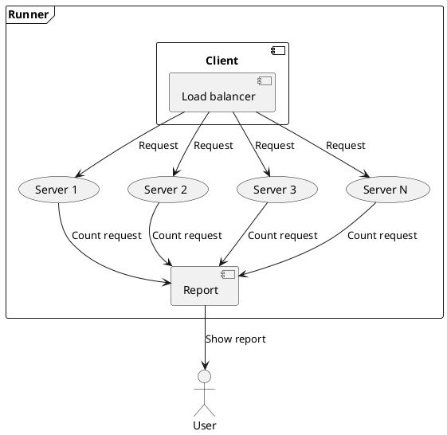

# balancer-demo

Демонстрация работы finagle loadbalancer

```plantuml
@startuml

frame Runner {

	(Server 1) as srv1
	(Server 2) as srv2
	(Server 3) as srv3
	(Server N) as srvN
	
	component Client as cl {
		[Load balancer] as lba
	}
	
	[Report] as report
	
	lba --> srv1: Request
	lba --> srv2: Request
	lba --> srv3: Request
	lba --> srvN: Request
	
	srv1 --> report : Count request
	srv2 --> report : Count request
	srv3 --> report : Count request
	srvN --> report : Count request
}

actor User

report --> User : Show report

@enduml
```